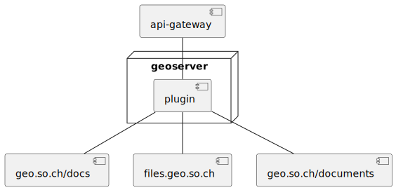
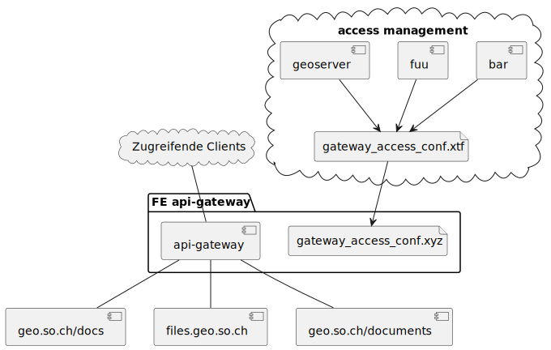

# Zugriffsschutz für Dateien

## Welche Ressource wird geschützt?

Es wird ein "vermittelter" Zugriffsschutz umgesetzt, in dem nicht die einzelnen Dateien zugriffsgeschützt werden, sondern der "virtuelle" Ordner, über den via HTTPS auf die Dateien zugegriffen wird.
Der virtuelle Ordner ist nichts weiteres wie der Pfadteil des entsprechenden HTTPS-Zugriffs auf die Datei. Der Zugriffsschutz wird ausschliesslich für das Protokoll HTTPS, Verb GET umgesetzt.

Durch dieses generische Konzept ist es nicht mehr von Bedeutung, ob die Dateien irgendwo physisch abgelegt sind, oder jeweils mit dem Request eines Benutzers zur Laufzeit erstellt werden.

Das Konzept wird angewendet auf:
* Den Datenbezug durch Schutz der Zugriffe auf files.geo.so.ch (Damit ist auch data.geo.so.ch geschützt)
* Dynamisch erzeugte Objektblätter / Listen zu einem Feature, Layer oder einer Themenbereitstellung (= "Reports")
* Statisch abgelegte Dateien / Dokumente zu einem Feature, Layer oder einer Themenbereitstellung (A la geo.so.ch/docs)

### Beispiele "virtueller" Ordner

Pfadteil des virtuellen Ordners jeweils in Klammern:
* https://files.geo.so.ch/(ch.bl.agi.lidar_2018.dtm_hillshade)/aktuell/ch.bl.agi.lidar_2018.dtm_hillshade.tif
* https://geo.so.ch/docs/(ch.so.afu.bodenprofile)/2401-11-T.png

### Aus Konfiguration Layerzugriff folgt Zugriffsregel für die Themenbereitstellung

Die Zugriffsberechtigung auf eine Themenbereitstellung erfolgt automatisch aufgrund der in der Bereitstellung enthaltenen Einzellayer. Die Berechtigungen werden also auf den Einzellayern (= DataSetView) in Geoserver gepflegt.

Kontext: Auf diese Weise ist der Zugriff für Facadelayer und Layergruppen in SIMI umgesetzt. Funktioniert problemlos.

## Umsetzungsvarianten

### Geoserver "Plugin"

Das Plugin kümmert sich einzig um die Frage, ob ein Request aufgrund des in der URL vorkommenden virtuellen Pfads an die Endpunkte der entsprechenden Ressourcen weitergeleitet wird. 

### Gateway

Aus dem access management resultiert die spezifische Konfiguration für den API-Gateway als XTF.

Die Formatumwandlung in das Format der Gateway-Konfiguration liegt in der Verantwortung der funktionalen Einheit "API-Gateway".

Der API-Gateway gewährt oder blockiert die Zugriffe auf die Endpunkte der Ressourcen.

Mögliche Gateways: Tyk, Kong, APISIX, KrakenD

### Direkt verworfene Varianten

* Jeweils Einzelschutz von files.geo.so.ch, geo.so.ch/docs und "Reports". Gründe:   
    * Die Logik des Zugriffsschutzes müsste mehrfach implementiert werden.
    * Einfache und universell erhältliche Komponenten wie Webserver könnten aufgrund der Zugriffsschutz-Anforderung nicht eingesetzt werden.
* Eigenentwicklung eines Gateway. Gründe:
    * Die Komplexität von Reverse-Proxies sollte nicht unterschätzt werden. Diese überwiegt den Vorteil, direkt "nativ" die Zugriffsinformationen konsumieren zu können. Zugriffsinformationen: Information, welche Rollen wie auf welche virtuelle Ordner zugreifen dürfen - voraussichtlich als XTF vorliegend.

## Anträge

* Die Umsetzung via virtuelle Ordner über HTTPS wird freigegeben.
    * Umgesetzt wird die Variante XXX. Deren Ausdetaillierung erfolgt im entsprechenden Umsetzungsprojekt.

